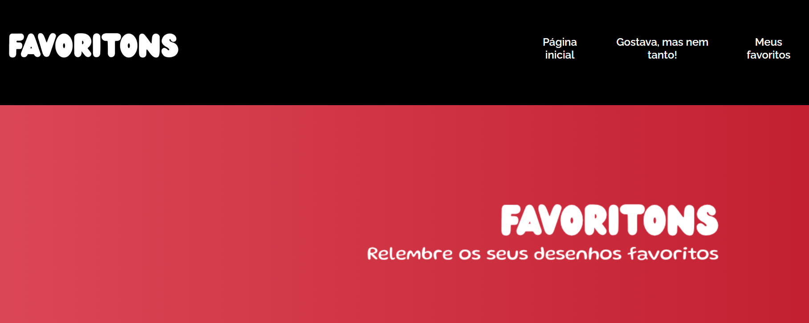
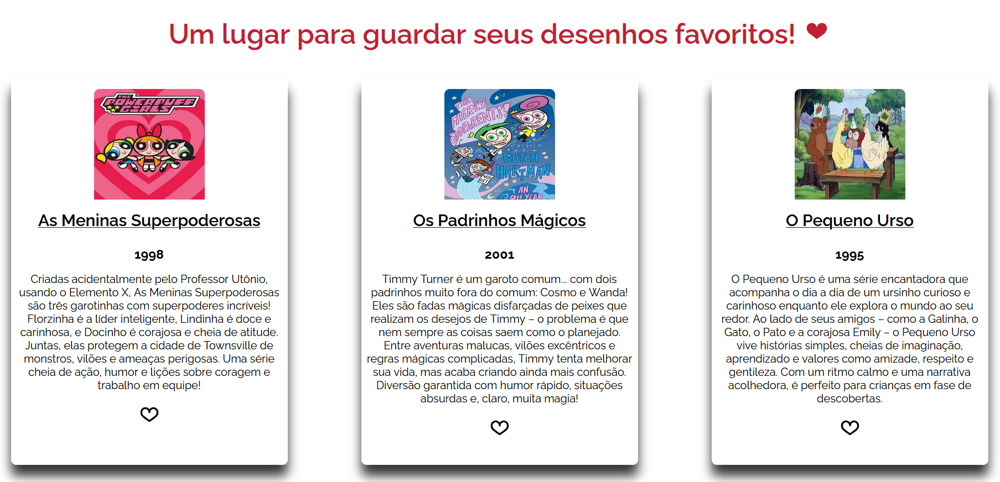
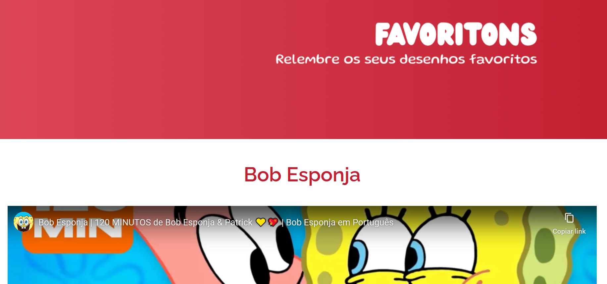

## ⭐ Favoritons

O **Favoritons** é uma aplicação dedicada à nostalgia dos desenhos animados dos anos **90 e 2000**, onde é possível **navegar pelas animações e favoritar seus preferidos**. Criado a partir de um projeto base da Alura, o projeto foi adaptado para oferecer uma experiência afetiva e personalizada, explorando conceitos fundamentais de React e boas práticas de componentização.

## 🚀 Sobre o Projeto

Este projeto foi desenvolvido durante o curso da Alura:

* "React: praticando React com JavaScript"

O **Favoritons** permite criar uma galeria personalizada de desenhos animados nostálgicos, possibilitando a navegação pelos conteúdos e a marcação dos favoritos. A aplicação é uma oportunidade de praticar **componentização, roteamento, hooks e contextos do React**, enquanto se trabalha com temas afetivos e divertidos.

## 📚 Objetivos do Curso

* Iniciar um projeto React;
* Construir componentes e páginas;
* Implementar rotas **normais, dinâmicas e aninhadas**;
* Aplicar os hooks **useState, useParams, useEffect e useContext**;
* Entender como funcionam os **contextos** do React;
* Consumir uma **API**;
* Realizar o **deploy** do projeto na Vercel.

## 🛠️ Tecnologias Utilizadas

                

## 🖼️ Visualização do Projeto

Uma prévia das principais funcionalidades do **Favoritons**:

**🌐 Acesse o Projeto Online**

O projeto está disponível para visualização na **Vercel**. Clique no link abaixo para acessar:

**🏠 Página Inicial**

Banner e navegação do Favoritons.

**⭐ Galeria de desenhos**

Tela principal com a galeria de desenhos animados e opção de favoritar os preferidos.

**📄 Detalhes do Desenho**

Ao clicar em um desenho, é possível visualizar um vídeo do desenho.

